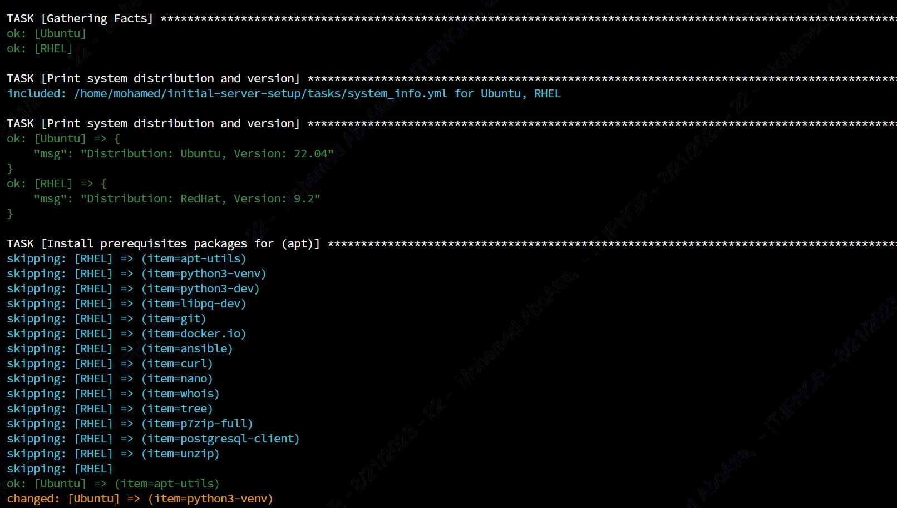

<!-- PROJECT SHIELDS -->
<!--
*** I'm using markdown "reference style" links for readability.
*** Reference links are enclosed in brackets [ ] instead of parentheses ( ).
*** See the bottom of this document for the declaration of the reference variables
*** for contributors-url, forks-url, etc. This is an optional, concise syntax you may use.
*** https://www.markdownguide.org/basic-syntax/#reference-style-links
-->

[![LinkedIn][linkedin-shield]][linkedin-url]

<!-- PROJECT LOGO -->
 

    

  <h3 align="center">Automated Initial Server Setup with Ansible (RHEL & Ubuntu)</h3>

<!-- TABLE OF CONTENTS -->

  
Table of Contents

  <ol>
    <li>
      <a href="#about-the-project">About The Project</a>
      <ul>
        <li><a href="#built-with">Built With</a></li>
      </ul>
    </li>
    <li><a href="#contact">Contact</a></li>
  </ol>

<!-- ABOUT THE PROJECT -->
## About The Project

* Project Name: Automated Initial Server Setup with Ansible (RHEL & Ubuntu)
* Version: v1.0.0
* Organization Department: Technology

### Description

This Ansible project streamlines the initial configuration of new servers 
running Ubuntu and Red Hat Enterprise Linux (RHEL) by automating a series 
of essential tasks. The project efficiently handles the following tasks on 
both Ubuntu and RHEL servers:

* Installation of key prerequisite packages, such as apt-utils, python3-venv, 
python3-dev, libpq-dev, git, docker.io, ansible, curl, nano, whois, 
tree, p7zip-full, postgresql-client, and unzip.

* Monitoring and execution of a system restart, when necessary, to apply 
changes effectively.

* Creation of a new sudo user, enhancing security and access control.

* Configuration of firewall rules to bolster server security.

* Generation of an SSH key pair, vital for secure remote access.

* Establishment of passwordless root access, enabling convenient administrative tasks.

* Configuration of Git, facilitating version control and collaboration.

* Pulling of specified GitHub projects, automating the retrieval of 
essential resources.

(<a href="#readme-top">back to top</a>)

### Built With

This project was developed using the following tech stacks:
* Ansible

(<a href="#readme-top">back to top</a>)

<!-- CONTACT -->
## Contact

Mohamed AbdelGawad Ibrahim - [@m-abdelgawad](https://www.linkedin.com/in/m-abdelgawad/) - <a href="tel:+201069052620">+201069052620</a> - muhammadabdelgawwad@gmail.com

GitHub Profile Link: [https://github.com/m-abdelgawad](https://github.com/m-abdelgawad)

(<a href="#readme-top">back to top</a>)

<!-- MARKDOWN LINKS & IMAGES -->
 [linkedin-shield]: https://img.shields.io/badge/-LinkedIn-black.svg?style=for-the-badge&logo=linkedin&colorB=555
[linkedin-url]: https://www.linkedin.com/in/m-abdelgawad/
